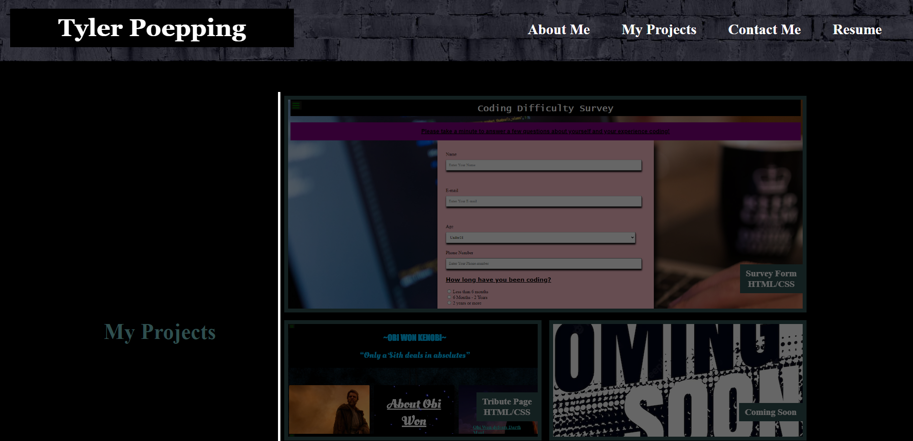

# Poepping-ReactPortfolio

# What is this?
- This is my portfolio built using react and other libraries together. Later on I will be creating a backend for this portfolio
- Due to issues with the gh-pages dependency the pages portion has been moved to another repository
- If you would still like to see how I created this application all my pushed and steps can be found in this current repository

# Usage
- You can use and view my portfolio at (https://sspenelope.github.io/react-portfolio/) 
- If you click the resume portion at the top of my portfolio the resume will be downloaded until I add an option to ask if you would like to download it first

## Available Scripts

In the project directory, you can run:

### `npm start`

Runs the app in the development mode.\
Open [http://localhost:3000](http://localhost:3000) to view it in your browser.

The page will reload when you make changes.\
You may also see any lint errors in the console.

### `npm test`

Launches the test runner in the interactive watch mode.\
See the section about [running tests](https://facebook.github.io/create-react-app/docs/running-tests) for more information.

### `npm run build`

Builds the app for production to the `build` folder.\
It correctly bundles React in production mode and optimizes the build for the best performance.

The build is minified and the filenames include the hashes.\
Your app is ready to be deployed!

See the section about [deployment](https://facebook.github.io/create-react-app/docs/deployment) for more information.

### `npm run eject`

**Note: this is a one-way operation. Once you `eject`, you can't go back!**

If you aren't satisfied with the build tool and configuration choices, you can `eject` at any time. This command will remove the single build dependency from your project.

Instead, it will copy all the configuration files and the transitive dependencies (webpack, Babel, ESLint, etc) right into your project so you have full control over them. All of the commands except `eject` will still work, but they will point to the copied scripts so you can tweak them. At this point you're on your own.

You don't have to ever use `eject`. The curated feature set is suitable for small and middle deployments, and you shouldn't feel obligated to use this feature. However we understand that this tool wouldn't be useful if you couldn't customize it when you are ready for it.

### `npm run deploy`

This is the command use deploy the application to github pages. Make sure you modify the "hompage" setting in the package.json to match your own repository name

# Credits
- The UofM coding bootcamp for teaching what I need to know to build this